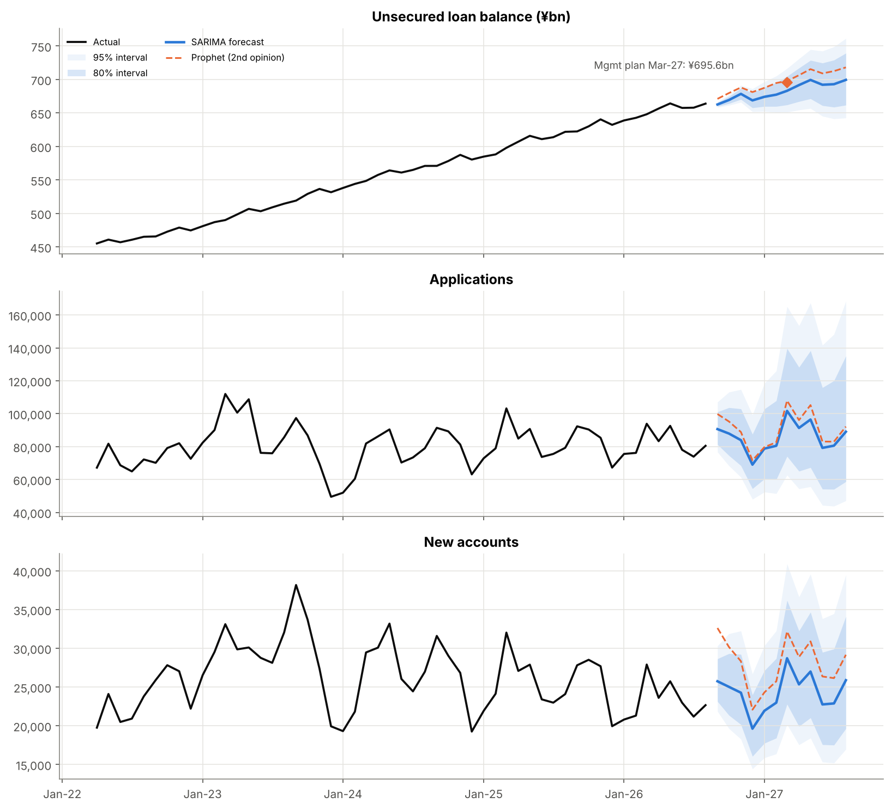
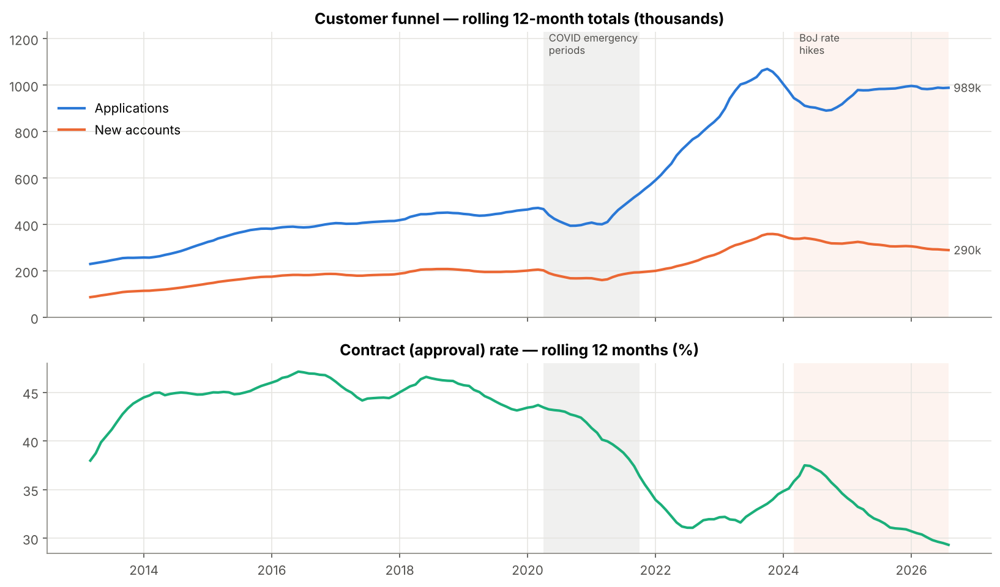
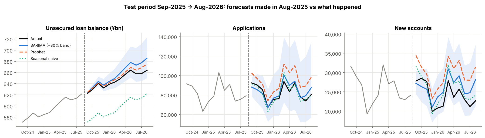
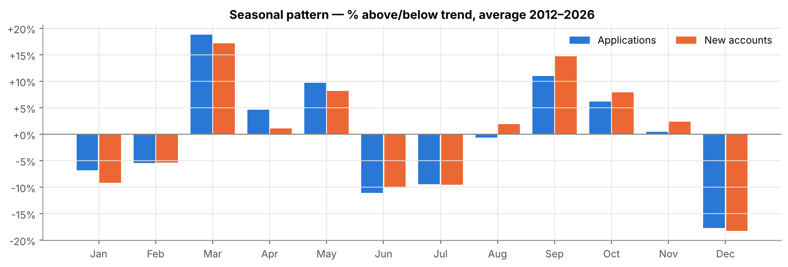

# Forecasting AIFUL's Business Performance Using Public IR Data

> **Business question:** Where will AIFUL's core consumer-loan business be in 12 months (loan balance and new-customer acquisition), and what should management do about it?

End-to-end project on **173 months of real, published data** (Apr-2012 → Aug-2026) from AIFUL's investor-relations *Monthly Data* reports: PDF parsing → validation → exploratory analysis → forecasting (SARIMA vs Prophet vs baseline, 9-origin backtest) → a one-page management report.

## Main insight

- **Demand is healthy; conversion is the problem.** Applications doubled after COVID to ~1 million a year, but the contract (approval) rate fell from **~45% to 28%**, so new customers have declined since FY2023.
- **Loan growth is slowing.** SARIMA forecasts the unsecured balance at **¥683bn in Mar-2027 (80% range ¥662–705bn)**, about **¥12bn below management's ¥695.6bn plan**. YoY growth falls from 6.8% to ~5.3% by Aug-2027.
- **The fix is in credit and channels, not ad volume.** Lifting the contract rate by 2 points on forecast applications adds ~11.8k customers, enough to close the 10.6k new-customer plan gap ([full report](reports/management_report.md)).



## Results: which model forecasts best?

Rolling-origin backtest: 9 forecast origins (Aug-2021 → Aug-2025, every 6 months), each forecasting 12 months ahead. The last origin is the classic train/test split (test = Sep-2025 → Aug-2026).

| Target | Model | Backtest MAPE | Backtest RMSE | Test-year MAPE |
|---|---|---|---|---|
| Unsecured loan balance | Seasonal naive | 8.2% | ¥45.4bn | 7.7% |
| | **SARIMA (2,1,0)(0,1,1)₁₂** | **1.2%** | **¥8.0bn** | 1.5% |
| | Prophet | 2.2% | ¥12.5bn | 0.7% |
| Applications | Seasonal naive | 20.0% | 17,077 | 3.6% |
| | **SARIMA (1,1,1)(1,1,1)₁₂** | **17.6%** | **14,629** | 4.5% |
| | Prophet | 23.9% | 19,357 | 14.6% |
| New accounts | Seasonal naive | 17.6% | 5,107 | 7.9% |
| | **SARIMA (2,1,1)(0,1,1)₁₂** | **15.9%** | **4,523** | 11.8% |
| | Prophet | 23.9% | 6,501 | 23.8% |

**SARIMA wins the backtest on every target.** In the single (unusually flat) test year, seasonal naive edges it on the customer flows, which is why the evaluation uses 9 origins rather than one split. Prophet extrapolated the 2022–23 surge and over-forecast new accounts by ~24%. SARIMA's 80% intervals contained the actual value 73–91% of the time, so they are usable as planning ranges.

| FY ending Mar-2027 | Management plan | Forecast | Gap |
|---|---|---|---|
| Unsecured balance (Mar-27) | ¥695.6bn | ¥683.1bn | −1.8% |
| New unsecured customers | 295,000 | 284,400 | −3.6% |

<details>
<summary><b>More charts</b></summary>




</details>

## Approach

1. **Data collection.** 15 official PDFs (one per fiscal year) parsed with `pdfplumber`. Japanese row labels are mapped to English columns, and two report-format changes (FY2024 wording, FY2025 layout) are handled.
2. **Validation (5 automated checks).** No missing months; contract rate = new accounts ÷ applications; loan components add up; spot-check against the PDF; and **our computed YoY growth matches the YoY % AIFUL prints, in all 161 comparable months** (max gap 0.05pp).
3. **EDA.** Trend, STL decomposition, seasonality (Mar/Sep demand peaks; Jun/Dec bonus-month repayments), credit quality, and an event timeline (2010 lending reform, COVID, BoJ rate hikes) with sources.
4. **Forecasting.** Log transform; COVID dummy; SARIMA orders chosen by AIC using only pre-backtest data (no leakage); Prophet with defaults; seasonal-naive baseline; MAPE, RMSE, bias and interval coverage.
5. **Management report.** One page: forecast vs plan, drivers, risks, 3 recommendations with targets and guardrails.

## Repository structure

```
aiful-business-forecast/
├── README.md
├── data/
│   ├── raw/                  # original PDFs - not committed (see licensing); run src/download_data.py
│   └── processed/            # aiful_monthly.csv (clean series), forecast_12m.csv
├── notebooks/
│   └── aiful_forecast.ipynb  # analysis + forecasting, with explanations, run top to bottom
├── reports/
│   ├── management_report.md / .pdf
│   ├── model_comparison.csv, backtest_results.csv
│   └── figures/              # all charts
├── src/
│   ├── download_data.py      # fetches the 15 PDFs from the IR site
│   └── build_dataset.py      # PDF -> clean monthly table + validation checks
├── requirements.txt
└── .gitignore
```

## How to run

Requires **Python 3.12+** (tested on 3.13).

```bash
git clone https://github.com/<your-username>/aiful-business-forecast.git
cd aiful-business-forecast
python -m venv .venv
.venv\Scripts\activate          # Windows  (macOS/Linux: source .venv/bin/activate)
pip install -r requirements.txt

python src/download_data.py     # 1. download the 15 PDFs into data/raw/
python src/build_dataset.py     # 2. parse + validate -> data/processed/aiful_monthly.csv
jupyter notebook notebooks/aiful_forecast.ipynb   # 3. run all cells (~2 min)
```

With Anaconda: `conda create -n aiful python=3.12`, then `conda activate aiful` and the same `pip install` line.

## Data & licensing

- **Source:** Muninova Holdings (former AIFUL Group) IR site: [Monthly Data](https://www.muninova.co.jp/en/ir/finance/monthly_data.html), [Financial Data Book](https://www.muninova.co.jp/en/ir/finance/databook.html), results-briefing Q&A.
- The site's [Terms of Use](https://www.muninova.co.jp/en/terms.html) allow reproduction for personal use and reference with the source cited, but not general republication. **The original PDFs are therefore not included in this repo**; `src/download_data.py` fetches them from the source.
- Only published figures are used; nothing is estimated or invented.

## Limitations

- Public data has no channel-level or applicant-level detail, so the contract-rate decline can be measured but not fully explained.
- Customer flows went through regime changes (post-COVID surge, 2024–25 contract-rate slide); flow forecasts carry ~16–18% backtest error and should be read with their intervals.
- SARIMA over-forecast new accounts by ~9% in the test year, so the risk to the new-customer forecast is to the downside.

---
*Independent portfolio project based on public information. Not affiliated with or endorsed by AIFUL Corporation or Muninova Holdings.*
