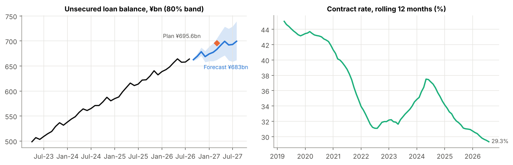

# AIFUL Consumer Loans: 12-Month Performance Outlook

**Prepared for:** AIFUL management · **Data to:** Aug-2026 (public Monthly Data) · **Forecast to:** Aug-2027 · **Model:** SARIMA, backtested over 9 periods

## 1. What the forecast says

| | Latest | Forecast | Plan (FY ending Mar-27) | Gap |
|---|---|---|---|---|
| Unsecured loan balance | ¥664.0bn (Aug-26, +6.8% YoY) | **¥683bn** at Mar-27 (80% range ¥662–705bn) | ¥695.6bn | **−¥12bn (−1.8%)** |
| New unsecured customers, FY | 299k in FY2025 | **284k** (−5.0% YoY) | 295k | **−11k (−3.6%)** |
| Applications, FY | 985k in FY2025 | **~1.0m** (+1.6%) | — | demand is stable |

**Bottom line:** demand is fine; **conversion is not.** At the current ~28% contract rate, loan growth slows from 6.8% to **~5.3% by Aug-2027**, and the balance plan is missed by ~¥12bn. The plan sits near the top of the 80% range: reachable only if conversion improves.

## 2. Key drivers

- **Contract rate (approvals ÷ applications):** 45% before COVID → **28.2%** in Aug-2026. This one number explains the new-customer decline; applications are flat-to-up.
- **Acquisition cost:** CPA rose to **¥58k** in Q1 vs a ¥52k plan, on a flat ¥15bn ad budget. Management says the issue is conversion, not lead volume.
- **Seasonality:** applications peak in **Mar/Sep** (+11–19% vs trend); balances shrink in **Jun/Dec** (bonus-month repayments, about −0.8% each).
- **Channel shift:** unstaffed branches fell from 585 to **40** in a year (plan: 0), so acquisition is now almost entirely digital and affiliate-led.

## 3. Risks

- **Downside to new customers.** In the test year, the model over-forecast new accounts by ~9% because it cannot see the contract-rate slide. If the slide continues, results come in below this forecast.
- **Funding-cost squeeze.** The BoJ raised rates to **1.25%** (Sep-2026). The group's financial expenses were already **+36% YoY** in Q1, while lending rates are capped by law at 15–20%.
- **Credit quality if approvals loosen.** The delinquency ratio has improved from 0.92% (FY2023 avg) to ~0.7%. Raising approvals must not reverse this.

## 4. Recommendations

1. **Credit — test a recalibrated score on near-miss declines.** Run a champion/challenger test (current model vs a recalibrated one, on a random sample) on applicants just below the approval cut-off; management says it may be declining lendable customers while charge-offs stay low. **Target:** +2pp contract rate on the ~592k applications forecast for Sep-26–Mar-27 = **~11.8k extra customers**, enough to close the 10.6k plan gap. **Guardrail:** delinquency ratio ≤ 0.8%.
2. **Channels — pay for contracts, not applications.** Move affiliate and ad payouts to **cost per contracted customer**, report the contract rate by channel every month, and shift budget to channels that convert. Weight spend toward the Mar/Sep demand peaks and away from Dec. **Target:** CPA back to ≤ ¥52k plan.
3. **Performance monitoring — monthly forecast-vs-actual with triggers.** Refresh this forecast each month when Monthly Data is published (25th). Escalate if new accounts fall below the model's 80% lower bound **2 months in a row**, or the contract rate drops below **27%**. Add a funding-rate scenario for each BoJ move.

---
*Sources: AIFUL/Muninova [Monthly Data](https://www.muninova.co.jp/en/ir/finance/monthly_data.html), [Data Book Q1 FY2027/3](https://www.muninova.co.jp/ir/xlsx/DB202606.xlsx) (plan, CPA, branches), results-briefing Q&A [Q1 FY27/3](https://www.muninova.co.jp/ir/pdf/SCRTE202606.pdf) and [FY26/3](https://www.muninova.co.jp/ir/pdf/SCRTE202603.pdf); [UPI](https://www.upi.com/Top_News/World-News/2026/09/18/japan-policy-rate-raised-central-bank-weak-yen/6681789772736/) (BoJ Sep-2026); [FSA](https://www.fsa.go.jp/policy/kashikin/qa.html) (interest-rate cap). Forecast method and accuracy: `notebooks/aiful_forecast.ipynb`. Independent analysis from public data; not affiliated with AIFUL.*
